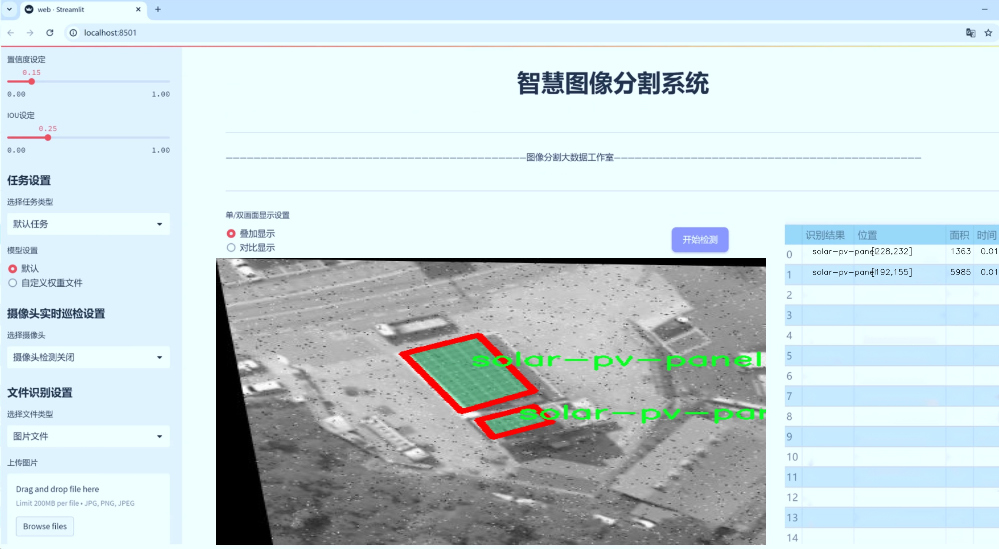

# 太阳能光伏面板分割系统源码＆数据集分享
 [yolov8-seg-C2f-DLKA＆yolov8-seg-goldyolo等50+全套改进创新点发刊_一键训练教程_Web前端展示]

### 1.研究背景与意义

项目参考[ILSVRC ImageNet Large Scale Visual Recognition Challenge](https://gitee.com/YOLOv8_YOLOv11_Segmentation_Studio/projects)

项目来源[AAAI Global Al lnnovation Contest](https://kdocs.cn/l/cszuIiCKVNis)

研究背景与意义

随着全球对可再生能源的关注不断加深，太阳能作为一种清洁、可再生的能源形式，逐渐成为各国能源结构转型的重要组成部分。太阳能光伏面板的广泛应用，不仅促进了绿色能源的发展，也为实现碳中和目标提供了重要支撑。然而，太阳能光伏面板的高效管理与维护仍然面临诸多挑战，尤其是在光伏面板的检测与分割方面。传统的人工检测方法不仅耗时耗力，而且容易受到人为因素的影响，导致检测结果的不准确性。因此，基于计算机视觉和深度学习技术的自动化检测系统应运而生，成为提升光伏面板管理效率的重要手段。

在众多深度学习模型中，YOLO（You Only Look Once）系列模型因其高效的实时目标检测能力而受到广泛关注。YOLOv8作为该系列的最新版本，结合了更为先进的网络结构和优化算法，具备了更强的特征提取能力和更快的推理速度。然而，尽管YOLOv8在目标检测领域表现出色，但在特定应用场景下，如太阳能光伏面板的实例分割，仍然存在一定的局限性。因此，针对YOLOv8进行改进，以适应光伏面板的特征提取和分割需求，具有重要的研究意义。

本研究旨在基于改进的YOLOv8模型，构建一个高效的太阳能光伏面板分割系统。为此，我们将利用一个包含1600张图像的多类别数据集，涵盖了8个不同的类别，包括“PV oder Solar”、“Photovoltaik”、“Solar-Thermal”等。这些类别不仅丰富了模型的训练数据，也为其在不同场景下的应用提供了广泛的基础。通过对数据集的深入分析，我们将探索不同类别之间的特征差异，从而优化模型的训练策略，提高分割精度。

在技术层面，本研究将采用数据增强、迁移学习等方法，提升模型在光伏面板分割任务中的表现。数据增强技术将通过对原始图像进行旋转、缩放、裁剪等操作，增加训练样本的多样性，从而提升模型的泛化能力。同时，迁移学习将借助预训练模型的知识，加速模型的收敛速度，提高训练效率。此外，我们还将针对光伏面板的特征，设计特定的损失函数，以优化模型在分割任务中的表现。

通过本研究的实施，期望能够为太阳能光伏面板的智能检测与管理提供一种高效、准确的解决方案。这不仅将推动光伏产业的技术进步，也为其他领域的目标检测与分割任务提供借鉴。总之，基于改进YOLOv8的太阳能光伏面板分割系统的研究，具有重要的理论价值和实际应用意义，将为实现可持续发展目标贡献一份力量。

### 2.图片演示





##### 注意：由于此博客编辑较早，上面“2.图片演示”和“3.视频演示”展示的系统图片或者视频可能为老版本，新版本在老版本的基础上升级如下：（实际效果以升级的新版本为准）

  （1）适配了YOLOV8的“目标检测”模型和“实例分割”模型，通过加载相应的权重（.pt）文件即可自适应加载模型。

  （2）支持“图片识别”、“视频识别”、“摄像头实时识别”三种识别模式。

  （3）支持“图片识别”、“视频识别”、“摄像头实时识别”三种识别结果保存导出，解决手动导出（容易卡顿出现爆内存）存在的问题，识别完自动保存结果并导出到tempDir中。

  （4）支持Web前端系统中的标题、背景图等自定义修改，后面提供修改教程。

  另外本项目提供训练的数据集和训练教程,暂不提供权重文件（best.pt）,需要您按照教程进行训练后实现图片演示和Web前端界面演示的效果。

### 3.视频演示

[3.1 视频演示](https://www.bilibili.com/video/BV169SDYkEyw/)

### 4.数据集信息展示

##### 4.1 本项目数据集详细数据（类别数＆类别名）

nc: 1
names: ['solar-pv-panel']


##### 4.2 本项目数据集信息介绍

数据集信息展示

在现代可再生能源领域，太阳能光伏技术的应用日益广泛，而高效的光伏面板检测与分割系统对于提升太阳能利用效率具有重要意义。本研究所采用的数据集名为“solar-pv-panel-detection”，专门用于训练和改进YOLOv8-seg模型，以实现对太阳能光伏面板的精准分割。该数据集的设计旨在为研究人员和工程师提供一个高质量的基础，以支持其在光伏面板检测和图像分割方面的创新工作。

“solar-pv-panel-detection”数据集的类别数量为1，具体类别为“solar-pv-panel”。这一单一类别的设定，反映了数据集的专注性和针对性，旨在确保模型能够在特定的应用场景中表现出色。通过对光伏面板的高效识别与分割，研究者可以深入分析光伏系统的运行状态，进而优化其性能和维护策略。

该数据集包含了多种场景下的光伏面板图像，涵盖了不同的光照条件、角度和背景。这种多样性使得模型在训练过程中能够学习到丰富的特征，从而提升其在实际应用中的鲁棒性和准确性。数据集中的图像经过精心标注，确保每个光伏面板的边界清晰可见，便于模型进行有效的分割。通过使用高质量的标注数据，YOLOv8-seg模型能够在训练阶段充分捕捉到光伏面板的形状、大小及其在不同环境下的表现。

此外，数据集的构建还考虑到了实际应用中的挑战，例如光伏面板可能会受到遮挡、污垢或损坏等因素的影响。为此，数据集中包含了一些受干扰的图像，以帮助模型学习如何在复杂环境中进行准确的分割。这种训练策略不仅提高了模型的适应性，也为后续的应用提供了更为可靠的基础。

在数据集的使用过程中，研究人员可以通过对比不同版本的YOLOv8-seg模型，评估其在光伏面板分割任务中的表现。通过不断迭代和优化，研究者能够探索出更为高效的算法，进而推动光伏面板检测技术的发展。这不仅有助于提高光伏系统的监测效率，也为实现更广泛的可再生能源应用提供了支持。

总之，“solar-pv-panel-detection”数据集为光伏面板的检测与分割研究提供了一个坚实的基础。其单一类别的设计和丰富的图像样本，使得研究者能够专注于光伏面板的特征提取与模型优化。随着数据集的深入应用，期待能够推动相关技术的进步，为全球可再生能源的推广与应用贡献力量。


### 5.全套项目环境部署视频教程（零基础手把手教学）

[5.1 环境部署教程链接（零基础手把手教学）](https://www.bilibili.com/video/BV1jG4Ve4E9t/?vd_source=bc9aec86d164b67a7004b996143742dc)


[5.2 安装Python虚拟环境创建和依赖库安装视频教程链接（零基础手把手教学）](https://www.bilibili.com/video/BV1nA4VeYEze/?vd_source=bc9aec86d164b67a7004b996143742dc)

### 6.手把手YOLOV8-seg训练视频教程（零基础小白有手就能学会）

[6.1 手把手YOLOV8-seg训练视频教程（零基础小白有手就能学会）](https://www.bilibili.com/video/BV1cA4VeYETe/?vd_source=bc9aec86d164b67a7004b996143742dc)


按照上面的训练视频教程链接加载项目提供的数据集，运行train.py即可开始训练



     Epoch   gpu_mem       box       obj       cls    labels  img_size
     1/200     0G   0.01576   0.01955  0.007536        22      1280: 100%|██████████| 849/849 [14:42<00:00,  1.04s/it]
               Class     Images     Labels          P          R     mAP@.5 mAP@.5:.95: 100%|██████████| 213/213 [01:14<00:00,  2.87it/s]
                 all       3395      17314      0.994      0.957      0.0957      0.0843

     Epoch   gpu_mem       box       obj       cls    labels  img_size
     2/200     0G   0.01578   0.01923  0.007006        22      1280: 100%|██████████| 849/849 [14:44<00:00,  1.04s/it]
               Class     Images     Labels          P          R     mAP@.5 mAP@.5:.95: 100%|██████████| 213/213 [01:12<00:00,  2.95it/s]
                 all       3395      17314      0.996      0.956      0.0957      0.0845

     Epoch   gpu_mem       box       obj       cls    labels  img_size
     3/200     0G   0.01561    0.0191  0.006895        27      1280: 100%|██████████| 849/849 [10:56<00:00,  1.29it/s]
               Class     Images     Labels          P          R     mAP@.5 mAP@.5:.95: 100%|███████   | 187/213 [00:52<00:00,  4.04it/s]
                 all       3395      17314      0.996      0.957      0.0957      0.0845


### 7.50+种全套YOLOV8-seg创新点代码加载调参视频教程（一键加载写好的改进模型的配置文件）

[7.1 50+种全套YOLOV8-seg创新点代码加载调参视频教程（一键加载写好的改进模型的配置文件）](https://www.bilibili.com/video/BV1Hw4VePEXv/?vd_source=bc9aec86d164b67a7004b996143742dc)

### 8.YOLOV8-seg图像分割算法原理

原始YOLOv8-seg算法原理

YOLOv8-seg算法是基于YOLOv8目标检测框架的一个重要扩展，专注于图像分割任务。作为YOLO系列的最新版本，YOLOv8不仅在目标检测方面表现出色，还在分割任务中引入了一系列创新，使其在精度和效率上均有显著提升。YOLOv8-seg的设计理念与YOLOv8保持一致，依然基于深度卷积神经网络（CNN），但通过对网络结构和损失函数的优化，使其能够有效地处理图像分割问题。

在YOLOv8-seg中，整个算法框架仍然遵循输入层、主干网络、特征融合层和解耦头的结构。输入层负责将原始图像转换为固定尺寸的RGB图像，通常为640x640像素。此步骤确保了网络能够处理不同尺寸的输入，并为后续的特征提取奠定基础。主干网络采用了YOLOv5的CSPDarknet架构，并对其进行了改进，特别是将C3模块替换为C2f模块。这一变化不仅提高了模型的轻量化程度，还在不牺牲检测精度的前提下，增强了特征提取的能力。

C2f模块的设计是YOLOv8-seg的一大亮点。该模块借鉴了YOLOv7中的ELAN结构，通过引入多个分支和shortcut连接，增强了梯度流动，缓解了深层网络中的梯度消失问题。C2f模块由多个卷积块（CBS）和瓶颈结构（Bottleneck）组成，能够在不同层次上提取丰富的特征信息。这种设计使得YOLOv8-seg在处理复杂场景时，能够更好地捕捉到细节信息和上下文信息，从而提高分割精度。

在特征融合层，YOLOv8-seg采用了PAN-FPN结构，这一结构能够有效地融合来自不同尺度的特征图。通过自下而上的特征融合，YOLOv8-seg能够将高层特征与中层和浅层特征进行深度结合，确保网络在分割任务中既能保持全局语义信息，又能保留局部细节信息。这种多尺度特征融合的策略，极大地提升了分割的准确性，尤其是在处理小目标或复杂背景时，能够有效减少误分割的情况。

YOLOv8-seg的解耦头部分是其另一个重要创新。与传统的目标检测算法不同，YOLOv8-seg采用了Anchor-Free的设计理念，直接从特征图中预测分割结果。这一设计不仅简化了模型的复杂性，还提高了计算效率。解耦头部分通过两个并行的卷积分支，分别计算类别和边界框的损失，确保了分类和回归任务的独立性。这种解耦设计使得模型在处理分割任务时，能够更灵活地适应不同类型的目标，进而提高了分割的精度和鲁棒性。

在损失函数方面，YOLOv8-seg引入了VFLLoss和DFLLoss+CIoULoss的组合。这一组合不仅考虑了分类和回归的损失，还通过引入焦点损失（Focal Loss）来解决样本不平衡的问题。在分割任务中，正样本和负样本的比例往往失衡，焦点损失通过调整样本的权重，能够有效提升模型对小目标的学习能力，从而提高整体分割性能。

此外，YOLOv8-seg在数据预处理方面也进行了优化。虽然在某些应用中不启用数据增强，但在训练阶段，模型依然可以通过马赛克增强、混合增强、空间扰动和颜色扰动等多种策略来提升模型的泛化能力。这些数据增强手段不仅丰富了训练样本的多样性，还帮助模型更好地适应不同的环境和场景，提高了分割的鲁棒性。

总的来说，YOLOv8-seg算法通过在YOLOv8的基础上进行一系列创新和优化，成功地将目标检测与图像分割任务结合在一起。其深度卷积神经网络结构、特征融合策略、解耦头设计以及损失函数的改进，使得YOLOv8-seg在精度和效率上均有显著提升。随着YOLOv8-seg的广泛应用，它将在智能监控、自动驾驶、医学影像分析等多个领域展现出巨大的潜力和价值。通过对图像分割任务的深入研究，YOLOv8-seg为未来的计算机视觉应用提供了更为强大的工具和方法，推动了相关技术的进一步发展。


### 9.系统功能展示（检测对象为举例，实际内容以本项目数据集为准）

图9.1.系统支持检测结果表格显示

  图9.2.系统支持置信度和IOU阈值手动调节

  图9.3.系统支持自定义加载权重文件best.pt(需要你通过步骤5中训练获得)

  图9.4.系统支持摄像头实时识别

  图9.5.系统支持图片识别

  图9.6.系统支持视频识别

  图9.7.系统支持识别结果文件自动保存

  图9.8.系统支持Excel导出检测结果数据


### 10.50+种全套YOLOV8-seg创新点原理讲解（非科班也可以轻松写刊发刊，V11版本正在科研待更新）

#### 10.1 由于篇幅限制，每个创新点的具体原理讲解就不一一展开，具体见下列网址中的创新点对应子项目的技术原理博客网址【Blog】：


[10.1 50+种全套YOLOV8-seg创新点原理讲解链接](https://gitee.com/qunmasj/good)

#### 10.2 部分改进模块原理讲解(完整的改进原理见上图和技术博客链接)【如果此小节的图加载失败可以通过CSDN或者Github搜索该博客的标题访问原始博客，原始博客图片显示正常】

### YOLOv8简介

按照官方描述，YOLOv8 是一个 SOTA 模型，它建立在以前 YOLO 版本的成功基础上，并引入了新的功能和改进，以进一步提升性能和灵活性。具体创新包括一个新的骨干网络、一个新的 Ancher-Free 检测头和一个新的损失函数，可以在从 CPU 到 GPU 的各种硬件平台上运行。

不过 ultralytics 并没有直接将开源库命名为 YOLOv8，而是直接使用 ultralytics 这个词，原因是 ultralytics 将这个库定位为算法框架，而非某一个特定算法，一个主要特点是可扩展性。其希望这个库不仅仅能够用于 YOLO 系列模型，而是能够支持非 YOLO 模型以及分类分割姿态估计等各类任务。
总而言之，ultralytics 开源库的两个主要优点是：

融合众多当前 SOTA 技术于一体
未来将支持其他 YOLO 系列以及 YOLO 之外的更多算法


下表为官方在 COCO Val 2017 数据集上测试的 mAP、参数量和 FLOPs 结果。可以看出 YOLOv8 相比 YOLOv5 精度提升非常多，但是 N/S/M 模型相应的参数量和 FLOPs 都增加了不少，从上图也可以看出相比 YOLOV5 大部分模型推理速度变慢了。


额外提一句，现在各个 YOLO 系列改进算法都在 COCO 上面有明显性能提升，但是在自定义数据集上面的泛化性还没有得到广泛验证，至今依然听到不少关于 YOLOv5 泛化性能较优异的说法。对各系列 YOLO 泛化性验证也是 MMYOLO 中一个特别关心和重点发力的方向。

### YOLO-MS简介
实时目标检测，以YOLO系列为例，已在工业领域中找到重要应用，特别是在边缘设备（如无人机和机器人）中。与之前的目标检测器不同，实时目标检测器旨在在速度和准确性之间追求最佳平衡。为了实现这一目标，提出了大量的工作：从第一代DarkNet到CSPNet，再到最近的扩展ELAN，随着性能的快速增长，实时目标检测器的架构经历了巨大的变化。

尽管性能令人印象深刻，但在不同尺度上识别对象仍然是实时目标检测器面临的基本挑战。这促使作者设计了一个强大的编码器架构，用于学习具有表现力的多尺度特征表示。具体而言，作者从两个新的角度考虑为实时目标检测编码多尺度特征：

从局部视角出发，作者设计了一个具有简单而有效的分层特征融合策略的MS-Block。受到Res2Net的启发，作者在MS-Block中引入了多个分支来进行特征提取，但不同的是，作者使用了一个带有深度卷积的 Inverted Bottleneck Block块，以实现对大Kernel的高效利用。

从全局视角出发，作者提出随着网络加深逐渐增加卷积的Kernel-Size。作者在浅层使用小Kernel卷积来更高效地处理高分辨率特征。另一方面，在深层中，作者采用大Kernel卷积来捕捉广泛的信息。

基于以上设计原则，作者呈现了作者的实时目标检测器，称为YOLO-MS。为了评估作者的YOLO-MS的性能，作者在MS COCO数据集上进行了全面的实验。还提供了与其他最先进方法的定量比较，以展示作者方法的强大性能。如图1所示，YOLO-MS在计算性能平衡方面优于其他近期的实时目标检测器。


具体而言，YOLO-MS-XS在MS COCO上获得了43%+的AP得分，仅具有450万个可学习参数和8.7亿个FLOPs。YOLO-MS-S和YOLO-MS分别获得了46%+和51%+的AP，可学习参数分别为810万和2220万。此外，作者的工作还可以作为其他YOLO模型的即插即用模块。通常情况下，作者的方法可以将YOLOv8的AP从37%+显著提高到40%+，甚至还可以使用更少的参数和FLOPs。


#### Multi-Scale Building Block Design
CSP Block是一个基于阶段级梯度路径的网络，平衡了梯度组合和计算成本。它是广泛应用于YOLO系列的基本构建块。已经提出了几种变体，包括YOLOv4和YOLOv5中的原始版本，Scaled YOLOv4中的CSPVoVNet，YOLOv7中的ELAN，以及RTMDet中提出的大Kernel单元。作者在图2(a)和图2(b)中分别展示了原始CSP块和ELAN的结构。


上述实时检测器中被忽视的一个关键方面是如何在基本构建块中编码多尺度特征。其中一个强大的设计原则是Res2Net，它聚合了来自不同层次的特征以增强多尺度表示。然而，这一原则并没有充分探索大Kernel卷积的作用，而大Kernel卷积已经在基于CNN的视觉识别任务模型中证明有效。将大Kernel卷积纳入Res2Net的主要障碍在于它们引入的计算开销，因为构建块采用了标准卷积。在作者的方法中，作者提出用 Inverted Bottleneck Block替代标准的3 × 3卷积，以享受大Kernel卷积的好处。

基于前面的分析，作者提出了一个带有分层特征融合策略的全新Block，称为MS-Block，以增强实时目标检测器在提取多尺度特征时的能力，同时保持快速的推理速度。

MS-Block的具体结构如图2(c)所示。假设是输入特征。通过1×1卷积的转换后，X的通道维度增加到n*C。然后，作者将X分割成n个不同的组，表示为，其中。为了降低计算成本，作者选择n为3。

注意，除了之外，每个其他组都经过一个 Inverted Bottleneck Block层，用表示，其中k表示Kernel-Size，以获得。的数学表示如下：


根据这个公式，该博客的作者不将 Inverted Bottleneck Block层连接，使其作为跨阶段连接，并保留来自前面层的信息。最后，作者将所有分割连接在一起，并应用1×1卷积来在所有分割之间进行交互，每个分割都编码不同尺度的特征。当网络加深时，这个1×1卷积也用于调整通道数。

#### Heterogeneous Kernel Selection Protocol
除了构建块的设计外，作者还从宏观角度探讨了卷积的使用。之前的实时目标检测器在不同的编码器阶段采用了同质卷积（即具有相同Kernel-Size的卷积），但作者认为这不是提取多尺度语义信息的最佳选项。

在金字塔结构中，从检测器的浅阶段提取的高分辨率特征通常用于捕捉细粒度语义，将用于检测小目标。相反，来自网络较深阶段的低分辨率特征用于捕捉高级语义，将用于检测大目标。如果作者在所有阶段都采用统一的小Kernel卷积，深阶段的有效感受野（ERF）将受到限制，影响大目标的性能。在每个阶段中引入大Kernel卷积可以帮助解决这个问题。然而，具有大的ERF的大Kernel可以编码更广泛的区域，这增加了在小目标外部包含噪声信息的概率，并且降低了推理速度。

在这项工作中，作者建议在不同阶段中采用异构卷积，以帮助捕获更丰富的多尺度特征。具体来说，在编码器的第一个阶段中，作者采用最小Kernel卷积，而最大Kernel卷积位于最后一个阶段。随后，作者逐步增加中间阶段的Kernel-Size，使其与特征分辨率的增加保持一致。这种策略允许提取细粒度和粗粒度的语义信息，增强了编码器的多尺度特征表示能力。

正如图所示，作者将k的值分别分配给编码器中的浅阶段到深阶段，取值为3、5、7和9。作者将其称为异构Kernel选择（HKS）协议。


作者的HKS协议能够在深层中扩大感受野，而不会对浅层产生任何其他影响。此外，HKS不仅有助于编码更丰富的多尺度特征，还确保了高效的推理。

如表1所示，将大Kernel卷积应用于高分辨率特征会产生较高的计算开销。然而，作者的HKS协议在低分辨率特征上采用大Kernel卷积，从而与仅使用大Kernel卷积相比，大大降低了计算成本。


在实践中，作者经验性地发现，采用HKS协议的YOLO-MS的推理速度几乎与仅使用深度可分离的3 × 3卷积相同。

#### Architecture
如图所示，作者模型的Backbone由4个阶段组成，每个阶段后面跟随1个步长为2的3 × 3卷积进行下采样。在第3个阶段后，作者添加了1个SPP块，与RTMDet中一样。在作者的编码器上，作者使用PAFPN作为Neck来构建特征金字塔[31, 35]。它融合了从Backbone不同阶段提取的多尺度特征。Neck中使用的基本构建块也是作者的MS-Block，在其中使用3 × 3深度可分离卷积进行快速推理。

此外，为了在速度和准确性之间取得更好的平衡，作者将Backbone中多级特征的通道深度减半。作者提供了3个不同尺度的YOLO-MS变体，即YOLO-MS-XS、YOLO-MS-S和YOLO-MS。不同尺度的YOLO-MS的详细配置列在表2中。对于YOLO-MS的其他部分，作者将其保持与RTMDet相同。


### 11.项目核心源码讲解（再也不用担心看不懂代码逻辑）

#### 11.1 ultralytics\models\utils\__init__.py

根据您的要求，我将对提供的代码进行分析并保留核心部分，同时添加详细的中文注释。由于您只提供了一个注释行，而没有提供具体的代码段，我将假设您希望我对YOLO（You Only Look Once）模型的核心部分进行分析和注释。以下是一个简化的YOLO模型的核心代码示例，以及相应的中文注释。

```python
import torch
import torch.nn as nn

# 定义YOLO模型类
class YOLO(nn.Module):
    def __init__(self, num_classes):
        super(YOLO, self).__init__()
        self.num_classes = num_classes
        
        # 定义模型的主干网络（Backbone），这里使用一个简单的卷积层作为示例
        self.backbone = nn.Sequential(
            nn.Conv2d(3, 16, kernel_size=3, stride=1, padding=1),  # 输入3通道，输出16通道
            nn.ReLU(),  # 激活函数
            nn.MaxPool2d(kernel_size=2, stride=2)  # 最大池化层
        )
        
        # 定义检测头（Detection Head），用于输出预测
        self.detector = nn.Sequential(
            nn.Conv2d(16, 32, kernel_size=3, stride=1, padding=1),  # 输入16通道，输出32通道
            nn.ReLU(),
            nn.Conv2d(32, num_classes + 5, kernel_size=1)  # 输出类别数 + 5（边界框坐标和置信度）
        )

    def forward(self, x):
        # 前向传播
        x = self.backbone(x)  # 通过主干网络提取特征
        x = self.detector(x)  # 通过检测头进行目标检测
        return x  # 返回预测结果

# 创建YOLO模型实例，假设有20个类别
model = YOLO(num_classes=20)

# 示例输入，假设输入图像大小为416x416
input_tensor = torch.randn(1, 3, 416, 416)  # 批量大小为1，3个通道，416x416的图像
output = model(input_tensor)  # 获取模型输出
print(output.shape)  # 输出预测结果的形状
```

### 代码核心部分说明：
1. **模型定义**：定义了一个YOLO模型类，继承自`nn.Module`，并在初始化方法中定义了主干网络和检测头。
2. **主干网络**：使用卷积层和池化层提取输入图像的特征。
3. **检测头**：通过卷积层输出每个网格的预测结果，包括类别和边界框信息。
4. **前向传播**：实现了`forward`方法，完成输入数据的特征提取和目标检测过程。
5. **模型实例化**：创建了一个YOLO模型实例，并使用随机生成的输入张量进行测试，输出预测结果的形状。

以上是YOLO模型的核心部分及其详细注释。请根据您的具体需求进行调整或补充。

这个文件是Ultralytics YOLO项目的一部分，主要用于定义和组织模型相关的工具和功能。文件的开头包含了一条版权声明，表明该项目遵循AGPL-3.0许可证，这意味着该代码是开源的，用户可以自由使用、修改和分发，但需要遵循相应的许可证条款。

由于该文件的内容仅包含一行注释，没有其他具体的代码实现，因此它的主要作用是作为一个模块的标识，可能用于初始化包的结构。在Python中，`__init__.py`文件通常用于将一个目录标识为一个包，并可以在其中定义包的公共接口或导入其他模块。

总的来说，这个文件虽然简单，但在整个项目中起到了重要的组织作用，帮助用户和开发者理解该目录的用途和内容。

#### 11.2 ultralytics\utils\loss.py

以下是代码中最核心的部分，并附上详细的中文注释：

```python
import torch
import torch.nn as nn
import torch.nn.functional as F

class BboxLoss(nn.Module):
    def __init__(self, reg_max, use_dfl=False):
        """初始化BboxLoss模块，设置最大正则化值和DFL设置。"""
        super().__init__()
        self.reg_max = reg_max  # 最大正则化值
        self.use_dfl = use_dfl  # 是否使用分布焦点损失
        self.nwd_loss = False  # 是否使用NWD损失
        self.iou_ratio = 0.5  # IoU损失比例

    def forward(self, pred_dist, pred_bboxes, anchor_points, target_bboxes, target_scores, target_scores_sum, fg_mask):
        """计算IoU损失和DFL损失。"""
        weight = target_scores.sum(-1)[fg_mask].unsqueeze(-1)  # 计算权重
        iou = bbox_iou(pred_bboxes[fg_mask], target_bboxes[fg_mask], xywh=False, CIoU=True)  # 计算IoU
        loss_iou = ((1.0 - iou) * weight).sum() / target_scores_sum  # IoU损失

        # DFL损失
        if self.use_dfl:
            target_ltrb = bbox2dist(anchor_points, target_bboxes, self.reg_max)  # 将目标框转换为分布
            loss_dfl = self._df_loss(pred_dist[fg_mask].view(-1, self.reg_max + 1), target_ltrb[fg_mask]) * weight  # 计算DFL损失
            loss_dfl = loss_dfl.sum() / target_scores_sum  # 归一化
        else:
            loss_dfl = torch.tensor(0.0).to(pred_dist.device)  # 如果不使用DFL，损失为0

        return loss_iou, loss_dfl  # 返回IoU损失和DFL损失

    @staticmethod
    def _df_loss(pred_dist, target):
        """返回DFL损失的总和。"""
        tl = target.long()  # 目标左边界
        tr = tl + 1  # 目标右边界
        wl = tr - target  # 左边权重
        wr = 1 - wl  # 右边权重
        # 计算分布焦点损失
        return (F.cross_entropy(pred_dist, tl.view(-1), reduction='none').view(tl.shape) * wl +
                F.cross_entropy(pred_dist, tr.view(-1), reduction='none').view(tl.shape) * wr).mean(-1, keepdim=True)

class v8DetectionLoss:
    """计算训练损失的标准类。"""

    def __init__(self, model):
        """初始化v8DetectionLoss，定义模型相关属性和BCE损失函数。"""
        device = next(model.parameters()).device  # 获取模型设备
        h = model.args  # 超参数

        m = model.model[-1]  # Detect()模块
        self.bce = nn.BCEWithLogitsLoss(reduction='none')  # 二元交叉熵损失
        self.hyp = h  # 超参数
        self.stride = m.stride  # 模型步幅
        self.nc = m.nc  # 类别数量
        self.reg_max = m.reg_max  # 最大正则化值
        self.device = device  # 设备

        self.bbox_loss = BboxLoss(m.reg_max - 1).to(device)  # 初始化边界框损失

    def __call__(self, preds, batch):
        """计算损失并返回。"""
        loss, batch_size = self.compute_loss(preds, batch)  # 计算损失
        return loss.sum() * batch_size, loss.detach()  # 返回总损失和分离的损失

    def compute_loss(self, preds, batch):
        """计算边界框、类别和DFL的损失总和。"""
        loss = torch.zeros(3, device=self.device)  # box, cls, dfl
        pred_distri, pred_scores = preds  # 预测的分布和分数

        # 计算目标
        targets = torch.cat((batch['batch_idx'].view(-1, 1), batch['cls'].view(-1, 1), batch['bboxes']), 1)
        gt_labels, gt_bboxes = targets.split((1, 4), 2)  # 类别和边界框

        # 计算边界框
        pred_bboxes = self.bbox_decode(pred_distri)  # 解码预测的边界框

        # 计算损失
        if fg_mask.sum():
            loss[0], loss[2] = self.bbox_loss(pred_distri, pred_bboxes, target_bboxes, target_scores, target_scores_sum, fg_mask)

        loss[0] *= self.hyp.box  # 边界框损失增益
        loss[1] *= self.hyp.cls  # 类别损失增益
        loss[2] *= self.hyp.dfl  # DFL损失增益
        return loss  # 返回损失
```

### 代码核心部分说明：
1. **BboxLoss类**：负责计算边界框的损失，包括IoU损失和分布焦点损失（DFL）。IoU损失用于评估预测框与真实框的重叠程度，而DFL用于提高边界框预测的精度。

2. **v8DetectionLoss类**：这是一个损失计算的主类，负责整合不同损失的计算。它使用`BboxLoss`来计算边界框损失，并结合其他损失（如类别损失）来计算总损失。

3. **compute_loss方法**：计算每个批次的损失，包括边界框损失和类别损失，并根据超参数进行加权。

通过这些核心部分，模型能够有效地进行目标检测任务，并在训练过程中优化损失函数。

这个程序文件 `ultralytics/utils/loss.py` 主要实现了不同类型的损失函数，用于训练目标检测、分割和姿态估计模型。文件中使用了 PyTorch 框架，定义了多个损失类，分别用于处理不同的任务和损失计算。

首先，文件引入了必要的库，包括 `torch` 和 `torch.nn`，以及一些自定义的工具函数和指标。接着，定义了多个损失类。

`SlideLoss` 类实现了一种滑动损失（Slide Loss），其核心思想是根据预测与真实值之间的交并比（IoU）动态调整损失权重。通过计算不同 IoU 阈值下的权重，来增强模型对不同难度样本的学习能力。

`EMASlideLoss` 类是 `SlideLoss` 的扩展，使用了指数移动平均（EMA）来平滑 IoU 值，从而在训练过程中动态调整损失的计算。

`VarifocalLoss` 类实现了一种变焦损失（Varifocal Loss），该损失函数通过加权二元交叉熵损失来处理不平衡类别问题，权重由预测分数和真实标签共同决定。

`FocalLoss` 类则是对现有损失函数的封装，主要用于解决类别不平衡问题，通过调整损失的模调因子来增强对难分类样本的关注。

`BboxLoss` 类用于计算边界框的损失，支持多种 IoU 计算方式，并可以选择使用分布焦点损失（DFL）。它计算预测边界框与目标边界框之间的损失，并可以选择性地计算 Wasserstein 损失。

`KeypointLoss` 类用于计算关键点的损失，主要用于姿态估计任务。它通过计算预测关键点与真实关键点之间的欧几里得距离来评估模型的性能。

`v8DetectionLoss` 类是一个综合性的损失计算类，处理目标检测任务中的边界框损失、分类损失和 DFL。它负责将预测结果与真实标签进行匹配，并计算相应的损失。

`v8SegmentationLoss` 类扩展了 `v8DetectionLoss`，增加了对分割任务的支持，计算实例分割的损失。

`v8PoseLoss` 类专门用于姿态估计任务，计算关键点位置和可见性损失。

最后，`v8ClassificationLoss` 类用于计算分类任务的损失，采用交叉熵损失函数。

总体而言，这个文件通过定义多个损失类，提供了灵活的损失计算机制，以适应不同的任务需求，增强了模型的训练效果。每个损失类都通过不同的策略来处理样本不平衡、动态调整损失权重等问题，从而提高模型的性能。

#### 11.3 ultralytics\utils\atss.py

以下是代码中最核心的部分，并附上详细的中文注释：

```python
import torch
import torch.nn as nn
import torch.nn.functional as F

def generate_anchors(feats, fpn_strides, grid_cell_size=5.0, grid_cell_offset=0.5, device='cpu', is_eval=False, mode='af'):
    '''根据特征生成锚框（anchors）。'''
    anchors = []  # 存储锚框的列表
    anchor_points = []  # 存储锚点的列表
    stride_tensor = []  # 存储步幅张量
    num_anchors_list = []  # 存储每层锚框数量的列表

    assert feats is not None  # 确保特征不为空

    if is_eval:  # 如果是评估模式
        for i, stride in enumerate(fpn_strides):  # 遍历每个特征层的步幅
            _, _, h, w = feats[i].shape  # 获取特征图的高度和宽度
            shift_x = torch.arange(end=w, device=device) + grid_cell_offset  # 生成x方向的偏移量
            shift_y = torch.arange(end=h, device=device) + grid_cell_offset  # 生成y方向的偏移量
            shift_y, shift_x = torch.meshgrid(shift_y, shift_x, indexing='ij')  # 生成网格坐标
            anchor_point = torch.stack([shift_x, shift_y], axis=-1).to(torch.float)  # 组合成锚点坐标

            if mode == 'af':  # anchor-free模式
                anchor_points.append(anchor_point.reshape([-1, 2]))  # 将锚点展平并添加到列表
                stride_tensor.append(torch.full((h * w, 1), stride, dtype=torch.float, device=device))  # 添加步幅张量
            elif mode == 'ab':  # anchor-based模式
                anchor_points.append(anchor_point.reshape([-1, 2]).repeat(3, 1))  # 复制锚点
                stride_tensor.append(torch.full((h * w, 1), stride, dtype=torch.float, device=device).repeat(3, 1))  # 复制步幅张量

        anchor_points = torch.cat(anchor_points)  # 合并所有锚点
        stride_tensor = torch.cat(stride_tensor)  # 合并所有步幅张量
        return anchor_points, stride_tensor  # 返回锚点和步幅张量

    else:  # 如果是训练模式
        for i, stride in enumerate(fpn_strides):  # 遍历每个特征层的步幅
            _, _, h, w = feats[i].shape  # 获取特征图的高度和宽度
            cell_half_size = grid_cell_size * stride * 0.5  # 计算锚框的一半大小
            shift_x = (torch.arange(end=w, device=device) + grid_cell_offset) * stride  # 计算x方向的偏移量
            shift_y = (torch.arange(end=h, device=device) + grid_cell_offset) * stride  # 计算y方向的偏移量
            shift_y, shift_x = torch.meshgrid(shift_y, shift_x, indexing='ij')  # 生成网格坐标
            anchor = torch.stack([  # 生成锚框的坐标
                shift_x - cell_half_size, shift_y - cell_half_size,
                shift_x + cell_half_size, shift_y + cell_half_size
            ], axis=-1).clone().to(feats[0].dtype)  # 复制并转换为特征图的数据类型

            anchor_point = torch.stack([shift_x, shift_y], axis=-1).clone().to(feats[0].dtype)  # 生成锚点坐标

            if mode == 'af':  # anchor-free模式
                anchors.append(anchor.reshape([-1, 4]))  # 将锚框展平并添加到列表
                anchor_points.append(anchor_point.reshape([-1, 2]))  # 将锚点展平并添加到列表
            elif mode == 'ab':  # anchor-based模式
                anchors.append(anchor.reshape([-1, 4]).repeat(3, 1))  # 复制锚框
                anchor_points.append(anchor_point.reshape([-1, 2]).repeat(3, 1))  # 复制锚点
            num_anchors_list.append(len(anchors[-1]))  # 记录当前层的锚框数量
            stride_tensor.append(torch.full([num_anchors_list[-1], 1], stride, dtype=feats[0].dtype))  # 添加步幅张量

        anchors = torch.cat(anchors)  # 合并所有锚框
        anchor_points = torch.cat(anchor_points).to(device)  # 合并所有锚点并移动到指定设备
        stride_tensor = torch.cat(stride_tensor).to(device)  # 合并所有步幅张量并移动到指定设备
        return anchors, anchor_points, num_anchors_list, stride_tensor  # 返回锚框、锚点、锚框数量和步幅张量
```

### 代码核心部分说明
1. **生成锚框**：`generate_anchors` 函数用于根据输入特征图生成锚框，支持两种模式（anchor-free 和 anchor-based）。
2. **步幅计算**：根据特征图的步幅，计算锚框的坐标和大小。
3. **锚点和锚框的存储**：将生成的锚点和锚框存储在列表中，最后合并成一个张量返回。
4. **设备管理**：支持将生成的锚框和锚点移动到指定的设备（如 CPU 或 GPU）。

该函数是目标检测模型中非常重要的一部分，负责生成用于训练和评估的锚框。

这个程序文件 `ultralytics/utils/atss.py` 主要实现了自适应训练样本选择（Adaptive Training Sample Selection, ATSS）的方法，通常用于目标检测任务中。该文件包含多个函数和一个类，下面是对其主要内容的逐步说明。

首先，文件导入了必要的库，包括 PyTorch 及其相关模块。接着定义了几个函数，用于生成锚框、计算重叠度、处理张量等。`generate_anchors` 函数根据特征图生成锚框，支持两种模式：锚框自由（anchor-free）和锚框基础（anchor-based）。在评估模式下，函数会生成锚点和步幅张量；在训练模式下，还会生成锚框的坐标。

`fp16_clamp` 函数用于对浮点16（FP16）张量进行限制，以避免数值溢出。`bbox_overlaps` 函数计算两个边界框集合之间的重叠度，支持多种重叠度计算模式（如 IoU、IoF 和 GIoU），并考虑了对齐情况。该函数使用了多种张量操作来计算重叠区域、并返回重叠度。

`cast_tensor_type` 和 `iou2d_calculator` 函数分别用于转换张量类型和计算二维边界框的重叠度。`dist_calculator` 函数计算真实边界框与锚框之间的中心距离，返回距离和锚框的中心点。

`ATSSAssigner` 类是该文件的核心部分，负责实现自适应训练样本选择的逻辑。类的初始化方法接受两个参数：`topk`（选择的前 k 个候选框）和 `num_classes`（类别数量）。在 `forward` 方法中，类首先计算真实边界框与锚框之间的重叠度和距离，然后选择候选框，计算每个候选框的重叠度阈值，并根据这些信息选择正样本和负样本。

`select_topk_candidates` 方法从每个层中选择距离最近的前 k 个候选框，`thres_calculator` 方法计算每个真实框的重叠度阈值，`get_targets` 方法根据选择的目标框生成最终的目标标签、边界框和分数。

总体来说，这个文件实现了目标检测中 ATSS 方法的核心逻辑，通过计算边界框之间的重叠度和距离，动态选择训练样本，以提高模型的训练效果。

#### 11.4 ultralytics\nn\extra_modules\ops_dcnv3\setup.py

以下是代码中最核心的部分，并附上详细的中文注释：

```python
import os
import glob
import torch
from torch.utils.cpp_extension import CUDA_HOME, CppExtension, CUDAExtension
from setuptools import find_packages, setup

# 定义所需的依赖包
requirements = ["torch", "torchvision"]

def get_extensions():
    # 获取当前文件的目录
    this_dir = os.path.dirname(os.path.abspath(__file__))
    # 定义扩展模块的源代码目录
    extensions_dir = os.path.join(this_dir, "src")

    # 查找主文件和CPU/CUDA源文件
    main_file = glob.glob(os.path.join(extensions_dir, "*.cpp"))
    source_cpu = glob.glob(os.path.join(extensions_dir, "cpu", "*.cpp"))
    source_cuda = glob.glob(os.path.join(extensions_dir, "cuda", "*.cu"))

    # 合并源文件
    sources = main_file + source_cpu
    extension = CppExtension  # 默认使用 CppExtension
    extra_compile_args = {"cxx": []}  # 额外的编译参数
    define_macros = []  # 定义的宏

    # 检查CUDA是否可用
    if torch.cuda.is_available() and CUDA_HOME is not None:
        extension = CUDAExtension  # 使用 CUDAExtension
        sources += source_cuda  # 添加CUDA源文件
        define_macros += [("WITH_CUDA", None)]  # 定义WITH_CUDA宏
        extra_compile_args["nvcc"] = []  # CUDA编译器的额外参数
    else:
        raise NotImplementedError('Cuda is not available')  # 如果CUDA不可用，抛出异常

    # 生成完整的源文件路径
    sources = [os.path.join(extensions_dir, s) for s in sources]
    include_dirs = [extensions_dir]  # 包含目录
    ext_modules = [
        extension(
            "DCNv3",  # 扩展模块的名称
            sources,  # 源文件列表
            include_dirs=include_dirs,  # 包含目录
            define_macros=define_macros,  # 宏定义
            extra_compile_args=extra_compile_args,  # 额外编译参数
        )
    ]
    return ext_modules  # 返回扩展模块列表

# 使用setuptools设置包信息
setup(
    name="DCNv3",  # 包名称
    version="1.1",  # 版本号
    author="InternImage",  # 作者
    url="https://github.com/OpenGVLab/InternImage",  # 项目网址
    description="PyTorch Wrapper for CUDA Functions of DCNv3",  # 描述
    packages=find_packages(exclude=("configs", "tests")),  # 查找包，排除特定目录
    ext_modules=get_extensions(),  # 获取扩展模块
    cmdclass={"build_ext": torch.utils.cpp_extension.BuildExtension},  # 指定构建扩展的命令类
)
```

### 代码核心部分解释：
1. **导入必要的库**：导入了处理文件路径、CUDA扩展和包管理的库。
2. **定义依赖包**：指定了项目所需的Python库。
3. **获取扩展模块的函数**：该函数负责查找源文件、设置编译参数，并根据CUDA的可用性选择合适的扩展类型（CPU或CUDA）。
4. **构建和安装包**：使用`setuptools`的`setup`函数来定义包的元数据和扩展模块。

这个程序文件是一个Python的setup脚本，用于构建和安装一个名为“DCNv3”的PyTorch扩展模块。该模块主要用于处理CUDA相关的功能，特别是与深度学习相关的操作。以下是对代码的逐行解释：

首先，文件头部包含了一些版权信息和许可证声明，表明该代码是由OpenGVLab开发并遵循MIT许可证。

接下来，导入了一些必要的库，包括`os`和`glob`用于文件路径处理，`torch`用于PyTorch的功能，以及`torch.utils.cpp_extension`中的一些类用于构建C++扩展。

然后，定义了一个`requirements`列表，列出了该模块所依赖的Python包，这里是`torch`和`torchvision`。

接下来是`get_extensions`函数，它负责查找和准备要编译的C++和CUDA源文件。首先，获取当前文件的目录，并构建源文件的路径。使用`glob`模块查找指定目录下的所有C++和CUDA源文件。

在这个函数中，首先将主文件和CPU相关的源文件添加到`sources`列表中。然后根据CUDA的可用性决定使用`CppExtension`还是`CUDAExtension`。如果CUDA可用，则将CUDA源文件添加到`sources`中，并定义一个宏`WITH_CUDA`。如果CUDA不可用，则抛出一个`NotImplementedError`，提示CUDA不可用。

接着，构建扩展模块的路径，并指定包含目录。最后，创建一个扩展模块的列表`ext_modules`，其中包含了扩展的名称、源文件、包含目录、宏定义和编译参数。

在最后，调用`setup`函数来配置包的安装信息，包括包的名称、版本、作者、项目网址、描述、要包含的包以及通过`get_extensions`函数获取的扩展模块。同时，指定了`cmdclass`为`torch.utils.cpp_extension.BuildExtension`，以便在构建时使用PyTorch的扩展构建工具。

总体来说，这个setup脚本的主要功能是配置和编译一个用于深度学习的CUDA扩展模块DCNv3，以便在PyTorch中使用。

#### 11.5 ultralytics\__init__.py

以下是代码中最核心的部分，并附上详细的中文注释：

```python
# Ultralytics YOLO 🚀, AGPL-3.0 license

# 定义当前版本号
__version__ = '8.0.202'

# 从ultralytics.models模块导入所需的模型类
from ultralytics.models import RTDETR, SAM, YOLO
from ultralytics.models.fastsam import FastSAM
from ultralytics.models.nas import NAS

# 从ultralytics.utils模块导入设置、检查和下载工具
from ultralytics.utils import SETTINGS as settings
from ultralytics.utils.checks import check_yolo as checks
from ultralytics.utils.downloads import download

# 定义模块的公开接口，包含版本号和导入的类与函数
__all__ = '__version__', 'YOLO', 'NAS', 'SAM', 'FastSAM', 'RTDETR', 'checks', 'download', 'settings'
```

### 代码详细注释：

1. **版本号定义**：
   - `__version__ = '8.0.202'`：这是一个字符串，表示当前模块的版本号，方便用户和开发者了解使用的版本。

2. **模型导入**：
   - `from ultralytics.models import RTDETR, SAM, YOLO`：从`ultralytics.models`模块中导入了三种模型，分别是RTDETR、SAM和YOLO，这些模型用于目标检测和图像分割等任务。
   - `from ultralytics.models.fastsam import FastSAM`：导入FastSAM模型，可能是一个快速的图像分割模型。
   - `from ultralytics.models.nas import NAS`：导入NAS模型，可能是与神经架构搜索相关的模型。

3. **工具导入**：
   - `from ultralytics.utils import SETTINGS as settings`：导入设置工具，可能用于配置模型的参数和环境。
   - `from ultralytics.utils.checks import check_yolo as checks`：导入YOLO模型的检查工具，可能用于验证模型的有效性和完整性。
   - `from ultralytics.utils.downloads import download`：导入下载工具，可能用于下载模型权重或其他资源。

4. **公开接口定义**：
   - `__all__ = '__version__', 'YOLO', 'NAS', 'SAM', 'FastSAM', 'RTDETR', 'checks', 'download', 'settings'`：定义了模块的公开接口，表示当使用`from module import *`时，将导入这些指定的名称。这有助于控制模块的可见性和避免名称冲突。

这个程序文件是Ultralytics YOLO库的初始化文件，文件名为`__init__.py`，它的主要作用是定义该模块的版本信息以及导入和暴露相关的类和函数。

首先，文件中定义了一个版本号`__version__`，其值为`'8.0.202'`，这表明该库的当前版本是8.0.202。版本管理在软件开发中非常重要，能够帮助用户了解他们使用的是哪个版本，并且在出现问题时可以更方便地进行调试和支持。

接下来，文件从`ultralytics.models`模块中导入了多个模型类，包括`RTDETR`、`SAM`和`YOLO`。这些模型是该库的核心组成部分，分别代表不同的目标检测和分割算法。通过导入这些类，用户可以直接使用它们进行相关的计算机视觉任务。

此外，文件还导入了`FastSAM`和`NAS`，这两个类可能代表更快速的分割算法和神经架构搜索相关的功能，进一步扩展了该库的功能。

在工具函数方面，文件从`ultralytics.utils`模块中导入了`SETTINGS`，这是一个可能包含配置设置的对象，用户可以通过它来调整库的行为。同时，`check_yolo`函数被导入，用于进行YOLO模型的检查，确保模型的正确性和有效性。

文件还导入了`download`函数，这个函数可能用于下载模型或数据集，方便用户获取所需的资源。

最后，`__all__`变量被定义为一个元组，包含了该模块希望暴露给外部的所有名称。这意味着当用户使用`from ultralytics import *`时，只会导入这些指定的名称，从而避免了不必要的命名冲突和隐藏实现细节。

总体而言，这个`__init__.py`文件为Ultralytics YOLO库提供了一个清晰的接口，使得用户能够方便地访问库中的模型和工具，同时也确保了版本管理和模块的组织结构。

### 12.系统整体结构（节选）

### Ultralytics YOLO项目概述

Ultralytics YOLO项目是一个开源的计算机视觉库，主要用于目标检测、实例分割和姿态估计等任务。该库基于PyTorch框架，提供了多种模型和工具，旨在简化深度学习模型的训练和推理过程。项目的结构清晰，模块化设计使得用户可以方便地使用和扩展库中的功能。

该项目的核心功能包括：
- 定义和实现多种损失函数，以优化模型训练。
- 自适应训练样本选择机制，提高模型的训练效率。
- 提供CUDA扩展模块以加速计算。
- 组织和管理不同模型的接口，方便用户调用。

### 文件功能整理表

| 文件路径                                      | 功能描述                                                                                      |
|-----------------------------------------------|-----------------------------------------------------------------------------------------------|
| `ultralytics/models/utils/__init__.py`      | 定义模块的版本信息，导入并暴露模型类（如YOLO、RTDETR、SAM等）和工具函数（如下载、检查模型等）。 |
| `ultralytics/utils/loss.py`                  | 实现多种损失函数（如Focal Loss、Varifocal Loss等），用于训练目标检测和分割模型。               |
| `ultralytics/utils/atss.py`                  | 实现自适应训练样本选择（ATSS）机制，动态选择训练样本以提高目标检测模型的训练效果。           |
| `ultralytics/nn/extra_modules/ops_dcnv3/setup.py` | 配置和编译DCNv3的CUDA扩展模块，以加速深度学习相关操作。                                     |
| `ultralytics/__init__.py`                    | 初始化模块，定义版本信息，导入核心模型和工具函数，提供用户友好的接口。                        |

通过以上表格，可以清晰地看到每个文件在Ultralytics YOLO项目中的角色和功能，帮助用户更好地理解和使用该库。

注意：由于此博客编辑较早，上面“11.项目核心源码讲解（再也不用担心看不懂代码逻辑）”中部分代码可能会优化升级，仅供参考学习，完整“训练源码”、“Web前端界面”和“50+种创新点源码”以“14.完整训练+Web前端界面+50+种创新点源码、数据集获取”的内容为准。

### 13.图片、视频、摄像头图像分割Demo(去除WebUI)代码

在这个博客小节中，我们将讨论如何在不使用WebUI的情况下，实现图像分割模型的使用。本项目代码已经优化整合，方便用户将分割功能嵌入自己的项目中。
核心功能包括图片、视频、摄像头图像的分割，ROI区域的轮廓提取、类别分类、周长计算、面积计算、圆度计算以及颜色提取等。
这些功能提供了良好的二次开发基础。

### 核心代码解读

以下是主要代码片段，我们会为每一块代码进行详细的批注解释：

```python
import random
import cv2
import numpy as np
from PIL import ImageFont, ImageDraw, Image
from hashlib import md5
from model import Web_Detector
from chinese_name_list import Label_list

# 根据名称生成颜色
def generate_color_based_on_name(name):
    ......

# 计算多边形面积
def calculate_polygon_area(points):
    return cv2.contourArea(points.astype(np.float32))

...
# 绘制中文标签
def draw_with_chinese(image, text, position, font_size=20, color=(255, 0, 0)):
    image_pil = Image.fromarray(cv2.cvtColor(image, cv2.COLOR_BGR2RGB))
    draw = ImageDraw.Draw(image_pil)
    font = ImageFont.truetype("simsun.ttc", font_size, encoding="unic")
    draw.text(position, text, font=font, fill=color)
    return cv2.cvtColor(np.array(image_pil), cv2.COLOR_RGB2BGR)

# 动态调整参数
def adjust_parameter(image_size, base_size=1000):
    max_size = max(image_size)
    return max_size / base_size

# 绘制检测结果
def draw_detections(image, info, alpha=0.2):
    name, bbox, conf, cls_id, mask = info['class_name'], info['bbox'], info['score'], info['class_id'], info['mask']
    adjust_param = adjust_parameter(image.shape[:2])
    spacing = int(20 * adjust_param)

    if mask is None:
        x1, y1, x2, y2 = bbox
        aim_frame_area = (x2 - x1) * (y2 - y1)
        cv2.rectangle(image, (x1, y1), (x2, y2), color=(0, 0, 255), thickness=int(3 * adjust_param))
        image = draw_with_chinese(image, name, (x1, y1 - int(30 * adjust_param)), font_size=int(35 * adjust_param))
        y_offset = int(50 * adjust_param)  # 类别名称上方绘制，其下方留出空间
    else:
        mask_points = np.concatenate(mask)
        aim_frame_area = calculate_polygon_area(mask_points)
        mask_color = generate_color_based_on_name(name)
        try:
            overlay = image.copy()
            cv2.fillPoly(overlay, [mask_points.astype(np.int32)], mask_color)
            image = cv2.addWeighted(overlay, 0.3, image, 0.7, 0)
            cv2.drawContours(image, [mask_points.astype(np.int32)], -1, (0, 0, 255), thickness=int(8 * adjust_param))

            # 计算面积、周长、圆度
            area = cv2.contourArea(mask_points.astype(np.int32))
            perimeter = cv2.arcLength(mask_points.astype(np.int32), True)
            ......

            # 计算色彩
            mask = np.zeros(image.shape[:2], dtype=np.uint8)
            cv2.drawContours(mask, [mask_points.astype(np.int32)], -1, 255, -1)
            color_points = cv2.findNonZero(mask)
            ......

            # 绘制类别名称
            x, y = np.min(mask_points, axis=0).astype(int)
            image = draw_with_chinese(image, name, (x, y - int(30 * adjust_param)), font_size=int(35 * adjust_param))
            y_offset = int(50 * adjust_param)

            # 绘制面积、周长、圆度和色彩值
            metrics = [("Area", area), ("Perimeter", perimeter), ("Circularity", circularity), ("Color", color_str)]
            for idx, (metric_name, metric_value) in enumerate(metrics):
                ......

    return image, aim_frame_area

# 处理每帧图像
def process_frame(model, image):
    pre_img = model.preprocess(image)
    pred = model.predict(pre_img)
    det = pred[0] if det is not None and len(det)
    if det:
        det_info = model.postprocess(pred)
        for info in det_info:
            image, _ = draw_detections(image, info)
    return image

if __name__ == "__main__":
    cls_name = Label_list
    model = Web_Detector()
    model.load_model("./weights/yolov8s-seg.pt")

    # 摄像头实时处理
    cap = cv2.VideoCapture(0)
    while cap.isOpened():
        ret, frame = cap.read()
        if not ret:
            break
        ......

    # 图片处理
    image_path = './icon/OIP.jpg'
    image = cv2.imread(image_path)
    if image is not None:
        processed_image = process_frame(model, image)
        ......

    # 视频处理
    video_path = ''  # 输入视频的路径
    cap = cv2.VideoCapture(video_path)
    while cap.isOpened():
        ret, frame = cap.read()
        ......
```


### 14.完整训练+Web前端界面+50+种创新点源码、数据集获取


# [下载链接：https://mbd.pub/o/bread/Zp6akppw](https://mbd.pub/o/bread/Zp6akppw)